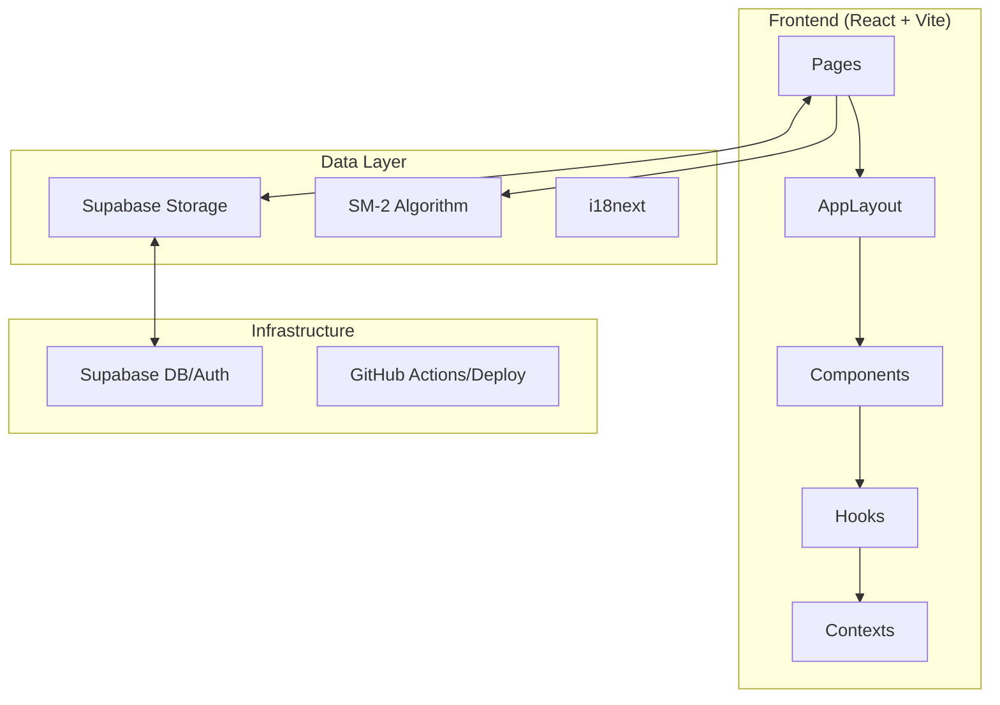

# Architecture — VocaFlash

This document outlines the technical architecture of VocaFlash, a premium tactile vocabulary learning system.

## System Overview

VocaFlash is built with a modern React stack, focusing on visual excellence, performance, and spaced repetition.

## Core Architectural Pillars

### 1. Dynamic Layout System
The application uses a unified `AppLayout` component that manages a three-column grid.
- **Left Sidebar**: Navigation and branding.
- **Main Content**: Scrollable area for Dashboard, Library, etc.
- **Right Sidebar**: Global status bar for streaks, XP, and reminders.

**Sidebar Logic**:
Persistence is handled via `SidebarContext`, allowing the app to calculate content margins dynamically when sidebars are collapsed.

### 2. Spaced Repetition (SRS)
We implement the **SM-2 algorithm** (`src/lib/srs.ts`).
- **Ease Factor**: Adjusts based on user ratings (0-5).
- **Interval**: Calculated exponentially unless the user fails (Rating < 3).
- **Due Date**: Stored as a timestamp in Supabase `user_progress`.

### 3. Data Synchronization
- **Phase 10 Update**: The app has migrated from `localStorage` to **Supabase** for all learner data.
- **Offline Fallback**: `streak.ts` maintains a localStorage fallback to ensure smooth operation during flaky connections.

### 4. Admin Management (Integrated CMS)
The project includes a secure `/admin` section with CRUD capabilities for:
- **Roadmaps**: High-level learning paths.
- **Topics**: Modular units of study.
- **Words**: Flashcard content with image support and preview logic.

## Layout Configuration Tokens
Defined in `SidebarContext.tsx`:
- `SIDEBAR_WIDTH`: 280px
- `SIDEBAR_COLLAPSED_WIDTH`: 80px
- `RIGHTBAR_WIDTH`: 320px
- `RIGHTBAR_COLLAPSED_WIDTH`: 64px
