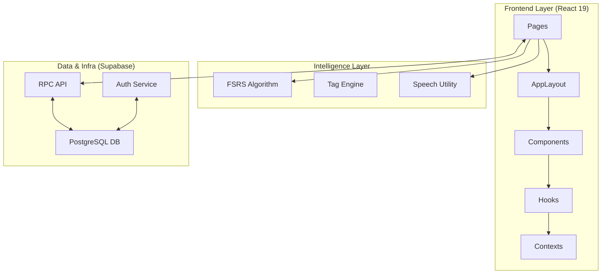

# Kiến trúc Hệ thống — VocaFlash

Tài liệu này mô tả kiến trúc kỹ thuật của VocaFlash, một hệ thống học từ vựng cao cấp dựa trên Spaced Repetition (SRS) và triết lý thiết kế Tactile Scholar.

## Tổng quan hệ thống

VocaFlash được xây dựng trên nền tảng React 19 + Vite, sử dụng Tailwind CSS v4 để quản lý giao diện và Supabase cho toàn bộ hạ tầng dữ liệu.

## Các trụ cột kiến trúc

### 1. Thuật toán Spaced Repetition (FSRS v5)
VocaFlash đã chuyển từ SM-2 sang **FSRS (Free Spaced Repetition Scheduler)** để tối ưu hóa hiệu quả ghi nhớ.
- **Stability & Difficulty**: Mỗi từ vựng có độ ổn định (stability) và độ khó (difficulty) riêng.
- **Retention-based Planning**: Người dùng có thể tùy chỉnh mức độ ghi nhớ mong muốn (Retention) trong cài đặt (Mặc định: 90%).
- **Lapse Handling**: Tự động chuyển từ vựng vào trạng thái `Relearning` khi người dùng quên.

### 2. Mô hình Dữ liệu Phân cấp (Domain Model)
- **Roadmap**: Những lộ trình học tập lớn (ví dụ: Oxford 3000, IELTS Core).
- **Topic**: Các chủ đề nhỏ nằm trong Roadmap (ví dụ: Technology, Environment).
- **Word**: Các flashcard đơn lẻ, bao gồm định nghĩa, ví dụ, hình ảnh và distractor choices (cho Review Arena).

### 3. Giao diện Tactile Scholar (Halo Modern)
Ngôn ngữ thiết kế tập trung vào cảm giác vật lý và sự tập trung:
- **Semantic Radius**: Sử dụng token `rounded-4xl` (40px) cho các container chính để tạo sự mềm mại.
- **Glassmorphism**: Sử dụng hiệu ứng mờ (backdrop-blur) cho các sidebar và modal để giữ được sự liên kết không gian.
- **Micro-animations**: Sử dụng `framer-motion` cho các tương tác lật thẻ và chuyển cảnh.

### 4. Quản lý Trạng thái & Side-effects
- **Custom Hooks**: Tách biệt logic xử lý (ví dụ: `useSettingsForm`, `useFlashcard`) khỏi UI.
- **Supabase RPC**: Tận dụng các hàm Database Functions (RPC) để đảm bảo tính nguyên tử (atomicity) khi cập nhật tiến độ học tập phức tạp.
- **i18n Implementation**: Sử dụng `react-i18next` với cấu trúc `vi.json` là nguồn sự thật (source of truth).

## Cấu hình Layout (SidebarContext)
Tất cả các thành phần giao diện tuân theo các token chiều rộng cố định:
- `SIDEBAR_WIDTH`: 256px
- `SIDEBAR_COLLAPSED_WIDTH`: 72px
- `RIGHTBAR_WIDTH`: 280px
- `RIGHTBAR_COLLAPSED_WIDTH`: 72px

---

*Tài liệu này được cập nhật tự động bởi Antigravity dựa trên cấu trúc mã nguồn hiện tại.*
