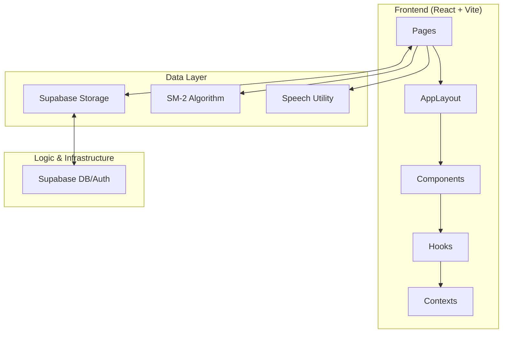

# Architecture — VocaFlash

This document outlines the technical architecture of VocaFlash, a premium tactile vocabulary learning system.

## System Overview

VocaFlash is built with a modern React stack, focusing on visual excellence, performance, and spaced repetition.

## Core Architectural Pillars

### 1. Pedagogical Routing Split
VocaFlash separates learning into two distinct domains:
- **Study Mode (`/study`)**: Passive/Contextual learning using Flashcards. Focuses on input.
- **Review Arena (`/review`)**: Active Recall testing. Uses a varied challenge-response loop to build retrieval strength.

### 2. Review Arena Challenge Engine
The `ChallengeManager` orchestrates 5 types of challenges based on a word's mastery level:
- **Recognition**: Multiple choice (True/False + Distractors).
- **Phonetics**: Auditory recognition.
- **Construction**: Word fragment re-ordering.
- **Context Gap**: Sentence-level fill-in-the-blanks.
- **Ghost Recall**: Full word retrieval from thin air.

**Adaptive Logic**: Challenges are chosen dynamically using `useReviewSession` which checks for the presence of examples, choices, and current SM-2 `repetitions`.

### 2. Spaced Repetition (SRS)
We implement the **SM-2 algorithm** (`src/lib/srs.ts`).
- **Ease Factor**: Adjusts based on user ratings (0-5).
- **Interval**: Calculated exponentially unless the user fails (Rating < 3).
- **Due Date**: Stored as a timestamp in Supabase `user_progress`.

### 3. Data Synchronization
- **Phase 10 Update**: The app has migrated from `localStorage` to **Supabase** for all learner data.
- **Offline Fallback**: `streak.ts` maintains a localStorage fallback to ensure smooth operation during flaky connections.

### 4. Admin Management (Integrated CMS)
The project includes a secure `/admin` section with CRUD capabilities for:
- **Roadmaps**: High-level learning paths.
- **Topics**: Modular units of study.
- **Words**: Flashcard content with image support and preview logic.

### 5. Media & Accessibility
- **Robust Audio**: All speech is managed through `src/lib/speech.ts` to clear global browser buffers before each utterance, preventing audio bleeding and duplication.
- **Zen Navigation**: Exiting immersive sessions is handled by internal custom modals (`ConfirmExitModal`) to bypass browser-native dialog limitations.

## Layout Configuration Tokens
Defined in `SidebarContext.tsx`:
- `SIDEBAR_WIDTH`: 280px
- `SIDEBAR_COLLAPSED_WIDTH`: 80px
- `RIGHTBAR_WIDTH`: 320px
- `RIGHTBAR_COLLAPSED_WIDTH`: 64px
