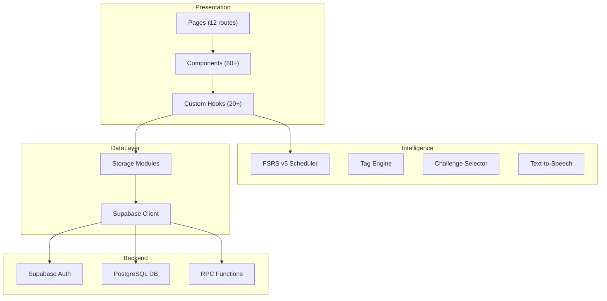

# Codebase Analysis

> **Quick Reference**
> - **Project**: VocaFlash — The Tactile Scholar
> - **Type**: Full-Stack Web App (SPA)
> - **Languages**: TypeScript (primary), CSS
> - **Frameworks**: React 19, Vite 8, Tailwind CSS v4, Supabase
> - **Lines of Code**: ~8,000+ (src/), 70+ test files
> - **Status**: Production

## Architecture



## Directory Structure

```
voca-flash/
├── src/
│   ├── App.tsx              # Root router + auth guards
│   ├── main.tsx             # Entry point
│   ├── pages/               # 12 route-level pages
│   │   ├── DashboardPage.tsx
│   │   ├── StudyPage.tsx
│   │   ├── ReviewPage.tsx
│   │   ├── LibraryPage.tsx
│   │   ├── MasteryPage.tsx
│   │   ├── ProgressPage.tsx
│   │   └── admin/           # 5 admin pages
│   ├── components/          # 80+ UI components
│   │   ├── study/           # Flashcard components
│   │   ├── review/          # Arena challenges (4 types)
│   │   ├── mastery/         # Mastery vault UI
│   │   ├── dashboard/       # Dashboard widgets
│   │   ├── progress/        # Analytics charts
│   │   ├── settings/        # Settings panels
│   │   ├── roadmap/         # Topic cards
│   │   └── admin/           # Admin management UI
│   ├── hooks/               # 20+ custom React hooks
│   ├── contexts/            # AuthContext, SidebarContext, RoadmapContext
│   ├── lib/
│   │   ├── srs.ts           # FSRS v5 algorithm
│   │   ├── challenge-logic.ts # Quadrant selector
│   │   ├── types.ts         # Shared TypeScript interfaces
│   │   ├── constants.ts     # Domain constants
│   │   ├── supabase.ts      # DB client singleton
│   │   ├── tag-engine.ts    # Auto-tagging
│   │   ├── tts.ts           # Text-to-Speech
│   │   ├── streak.ts        # Study streak logic
│   │   ├── queries/         # Supabase query functions
│   │   └── storage/         # Storage abstraction modules
│   └── i18n/                # Translations (en.json, vi.json)
├── tests/
│   ├── unit/                # 60+ Vitest unit tests
│   └── e2e/                 # 8 Playwright E2E tests
├── docs/                    # This documentation
├── scripts/                 # DB migration helpers
└── public/                  # Static assets
```

## Dependencies

| Category | Package | Version | Purpose |
|----------|---------|---------|---------|
| Core | react | ^19.2.5 | UI framework |
| Core | react-dom | ^19.2.5 | DOM renderer |
| Routing | react-router-dom | ^7.14.0 | Client-side routing |
| Database | @supabase/supabase-js | ^2.103.0 | Backend-as-a-Service |
| SRS | ts-fsrs | ^5.3.2 | FSRS v5 algorithm |
| Styling | tailwindcss | ^4.2.2 | Utility CSS |
| Animation | framer-motion | ^12.38.0 | Micro-animations |
| Charts | recharts | ^3.8.1 | Progress charts |
| i18n | i18next + react-i18next | ^26.0.4 | Bilingual UI |
| Editor | @tiptap/react | ^3.22.4 | Rich note editor |
| Drag-Drop | @dnd-kit/core | ^6.3.1 | Word reordering |
| CSV | papaparse | ^5.5.3 | Word import |
| Markdown | react-markdown | ^10.1.0 | Content rendering |
| Testing | vitest | ^4.1.4 | Unit test runner |
| E2E | @playwright/test | ^1.59.1 | Browser tests |

## Route Map

| Path | Component | Auth | Role | Description |
|------|-----------|------|------|-------------|
| `/` | LandingPage | No | — | Marketing landing |
| `/login` | LoginPage | No | — | Auth form |
| `/dashboard` | DashboardPage | Yes | User | Daily mission + stats |
| `/study` | StudyPage | Yes | User | Flashcard study session |
| `/review` | ReviewPage | Yes | User | Review Arena (5 challenge types) |
| `/library` | LibraryPage | Yes | User | Browse roadmaps |
| `/library/:slug` | RoadmapTopicsPage | Yes | User | Topics in roadmap |
| `/mastery` | MasteryPage | Yes | User | Mastery Vault |
| `/progress` | ProgressPage | Yes | User | Analytics |
| `/settings` | SettingsPage | Yes | User | Profile + SRS config |
| `/methodology` | MethodologyPage | Yes | User | Learning methodology |
| `/free-study` | FreeStudyPage | Yes | User | Unscheduled practice |
| `/admin` | AdminDashboardPage | Yes | Admin | Admin overview |
| `/admin/words` | AdminWordsPage | Yes | Admin | Word CRUD |
| `/admin/roadmaps` | AdminRoadmapsPage | Yes | Admin | Roadmap management |
| `/admin/roadmaps/:id/setup` | RoadmapSetupPage | Yes | Admin | Topic/word setup |
| `/admin/users` | AdminUsersPage | Yes | Admin | User management |

## Database Schema

| Table | Purpose | Key Columns |
|-------|---------|-------------|
| `roadmaps` | Learning roadmaps | id, name, slug, is_active |
| `topics` | Topic groups within roadmaps | id, roadmap_id, name, slug, icon, color |
| `words` | Vocabulary flashcards | id, word, phonetic, pos, difficulty, definition, tags[] |
| `word_choices` | MC wrong options | id, word_id, choice, sort |
| `topic_words` | Junction: word ↔ topic | topic_id, word_id |
| `user_profiles` | User settings + stats | id, daily_target, srs_intensity, streak_days |
| `user_srs_records` | FSRS scheduling data | user_id, word_id, fsrs_stability, fsrs_state, next_review_at |
| `user_resume_pointers` | Last studied topic | user_id, roadmap_id, last_topic_id |

## Key Files

| File | Role | Lines |
|------|------|-------|
| `src/lib/srs.ts` | FSRS v5 scheduler + SRS utilities | ~290 |
| `src/lib/challenge-logic.ts` | Quadrant selection algorithm | ~130 |
| `src/lib/types.ts` | All shared TypeScript interfaces | ~285 |
| `src/lib/constants.ts` | Domain constants (SRS thresholds, timers) | ~126 |
| `src/contexts/AuthContext.tsx` | Auth + profile state management | ~299 |
| `src/lib/queries/word-queries.ts` | Word CRUD + batch import | ~280 |
| `src/App.tsx` | Router + auth guards | ~96 |

## Test Coverage

| Framework | Test Files | Test Type |
|-----------|-----------|-----------|
| Vitest | 60+ unit tests | Unit + Integration |
| Playwright | 8 E2E specs | Browser end-to-end |
| Vitest | srs-fsrs.test.ts, srs-migration.test.ts | Algorithm verification |
