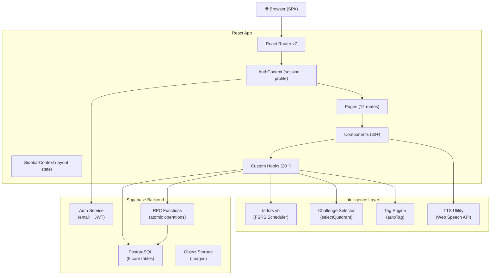
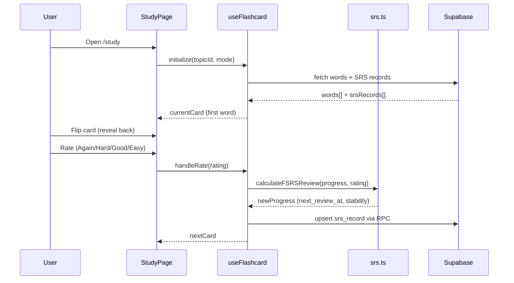
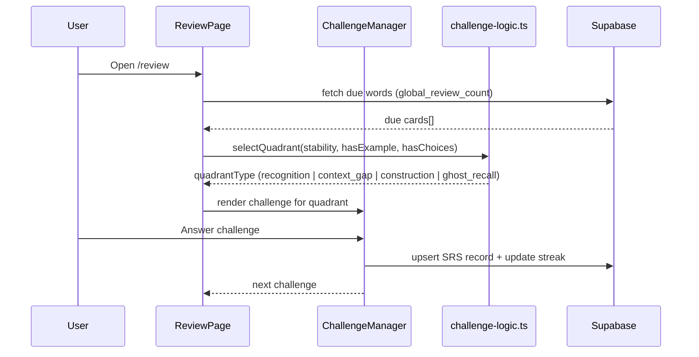

# System Architecture

> **Quick Reference**
> - **Type**: Single-Page Application (SPA)
> - **Stack**: React 19, Vite 8, TypeScript, Tailwind CSS v4, Supabase
> - **Key Modules**: FSRS Scheduler, Review Arena, Mastery Vault, Admin Panel
> - **Deployment**: Static hosting (Vite build) + Supabase managed backend

## Overview

VocaFlash is a premium English vocabulary learning platform. It uses the **FSRS v5 algorithm** (Free Spaced Repetition Scheduler) — the current state-of-the-art in memory science — to schedule personalized review sessions. The "Tactile Scholar" design philosophy prioritizes focus and minimal friction.

**User journey**: Browse Library → Study flashcards → Review Arena → Track progress in Mastery Vault.

See also: [Database](./database.md) · [Data Flow](./data-flow.md) · [Deployment](./deployment.md)

## Architecture Diagram

## Core Components

| Component | Description | Technology | Key Files |
|-----------|-------------|------------|-----------|
| **FSRS Scheduler** | Calculates next review date per word per user | ts-fsrs v5 | `src/lib/srs.ts` |
| **Review Arena** | 4 challenge types: Recognition, ContextGap, Construction, GhostRecall | React + framer-motion | `src/components/review/` |
| **Study Session** | Flashcard flip with FSRS rating buttons | React | `src/components/study/` |
| **Mastery Vault** | Filtered, sorted word collection with FSRS stats | React + Supabase RPC | `src/pages/MasteryPage.tsx` |
| **AuthContext** | User session, profile, admin flag, TTS sync | React Context | `src/contexts/AuthContext.tsx` |
| **Admin Panel** | Word/roadmap/user management with bulk import | React + Supabase | `src/pages/admin/` |
| **Progress Analytics** | Charts: heatmap, FSRS bins, forecast, memory health | recharts | `src/components/progress/` |

## Application Layers

### Presentation Layer

Routes and pages are defined in `src/App.tsx`. Lazy loading (`React.lazy`) is used on every route-level component to minimize initial bundle size.

Two route guards protect access:
- `RequireAuth` — redirects to `/login` if unauthenticated (`src/App.tsx`)
- `RequireAdmin` — redirects to `/dashboard` if user lacks admin role (`src/App.tsx`)

### Business Logic Layer

Custom hooks encapsulate all domain logic:

| Hook | Domain | File |
|------|--------|------|
| `useFlashcard` | Flashcard study + FSRS rating | `src/hooks/useFlashcard.ts` |
| `useReviewSession` | Arena session orchestration | `src/hooks/useReviewSession.ts` |
| `useFreeStudySession` | Unscheduled practice | `src/hooks/useFreeStudySession.ts` |
| `useStudySessionMode` | New/combined/all mode selector | `src/hooks/useStudySessionMode.ts` |
| `useMasteryWords` | Mastery vault data + filtering | `src/hooks/useMasteryWords.ts` |
| `useDashboard` | Daily mission + stats | `src/hooks/useDashboard.ts` |
| `useProgress` | Progress analytics | `src/hooks/useProgress.ts` |
| `useSettingsForm` | Settings form state | `src/hooks/useSettingsForm.ts` |
| `useStreak` | Streak calculation + longest | `src/hooks/useStreak.ts` |

### Data Layer

All Supabase interactions go through typed query modules in `src/lib/queries/`:

| Module | Tables Touched |
|--------|---------------|
| `word-queries.ts` | `words`, `word_choices`, `topic_words` |
| `roadmap-queries.ts` | `roadmaps`, `topics`, `topic_words` |
| `user-queries.ts` | `user_profiles`, `user_resume_pointers` |
| `stats-queries.ts` | `user_srs_records` (via RPC) |
| `topic-queries.ts` | `topics` |
| `tag-queries.ts` | `words.tags` |

Storage abstraction modules in `src/lib/storage/` wrap Supabase calls with typed interfaces.

## Main Processing Flow

### Study Session (Flashcard)

### Review Arena (Challenge)

## Architecture Decision Records

| # | Decision | Context | Status |
|---|----------|---------|--------|
| 1 | FSRS v5 over SM-2 | SM-2 cannot model forgetting curves accurately | Accepted |
| 2 | Supabase over custom API | Zero backend infra cost, built-in auth + real-time | Accepted |
| 3 | SPA over SSR | Learning app doesn't need SEO; SPA = simpler deploy | Accepted |
| 4 | React Context over Redux | App state is narrow (auth + sidebar); no need for Redux | Accepted |
| 5 | RPC for atomic operations | Multi-table writes (SRS + streak + points) must be atomic | Accepted |
| 6 | vi.json as i18n source of truth | App is built for Vietnamese learners first | Accepted |

ADR-001: FSRS v5 Algorithm

**Context:** Original SM-2 implementation had inaccurate retention predictions. Users reported forgetting words scheduled "too far in the future."

**Decision:** Migrate to ts-fsrs (FSRS v5) which models memory stability and forgetting curves more accurately.

**Consequences:**
- ✅ Personalized scheduling based on per-word stability
- ✅ User-configurable retention target (80–95%)
- ⚠️ SM-2 migration script required for existing users (`src/lib/srs.ts:241`)
- ❌ Slightly higher algorithmic complexity

ADR-002: Admin Role via Env Variable

**Context:** A lightweight admin system was needed without a full RBAC database table.

**Decision:** Admin emails are stored in `VITE_ADMIN_EMAILS` env variable. Checked in `AuthContext` at login (`src/contexts/AuthContext.tsx:43`).

**Consequences:**
- ✅ Zero DB overhead for role checking
- ⚠️ Admin list requires re-deploy to change
- ❌ Not suitable if many admins are needed

## Security

| Concern | Approach |
|---------|---------|
| **Authentication** | Supabase JWT sessions, managed by `AuthContext` |
| **Route protection** | `RequireAuth` and `RequireAdmin` guards in `App.tsx` |
| **Admin access** | Email allowlist in `VITE_ADMIN_EMAILS` env var |
| **Data isolation** | Row-Level Security (RLS) in PostgreSQL enforces per-user data access |
| **API keys** | `VITE_SUPABASE_ANON_KEY` — public anon key, safe for client-side |
| **Secrets** | Service role key never exposed to frontend |

:::warning Security
Never expose the Supabase **service role key** in client-side code. Only the anon key (`VITE_SUPABASE_ANON_KEY`) should be in frontend env vars.
:::

## Scalability & Performance

| Aspect | Strategy | Detail |
|--------|----------|--------|
| **Code splitting** | `React.lazy` per route | Bundle per page loaded on demand |
| **SRS computation** | Client-side FSRS | No server load for scheduling |
| **DB reads** | Mega-RPC pattern | `fetchInitialAppData` = 1 round-trip on login |
| **Animations** | `framer-motion` | 60fps spring animations, GPU-composited |
| **Images** | URL-based (CDN) | No self-hosted image storage overhead |
| **i18n** | Static JSON bundles | No runtime translation API calls |
