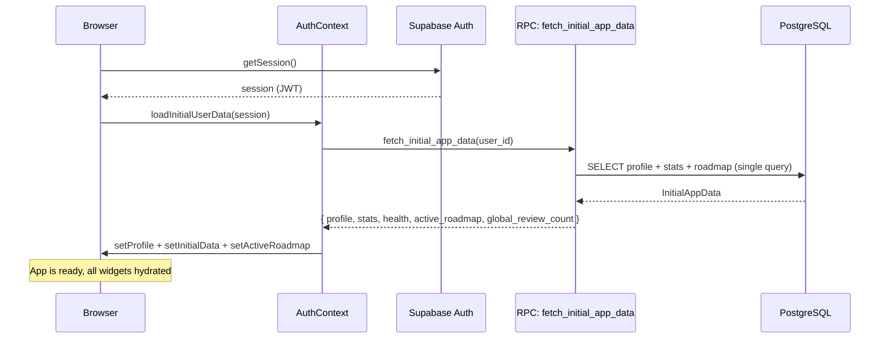
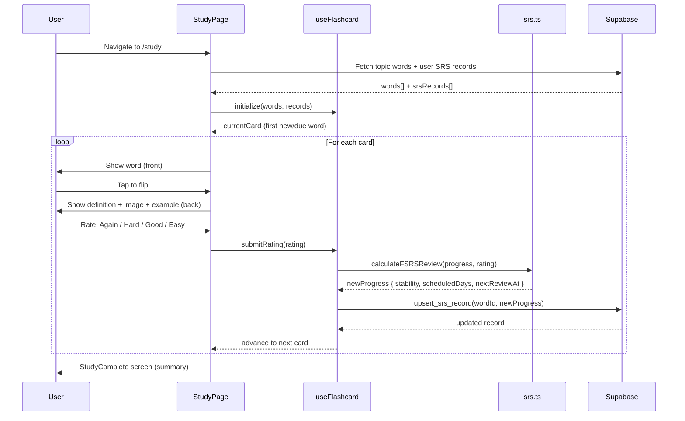
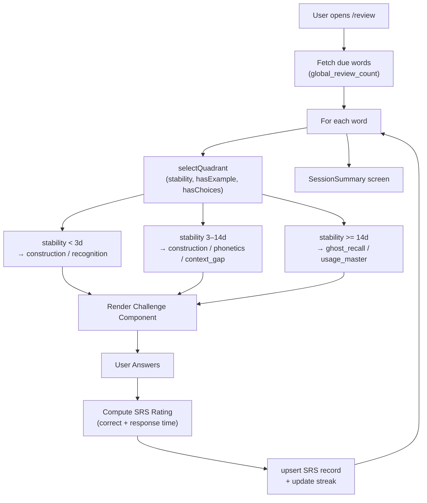
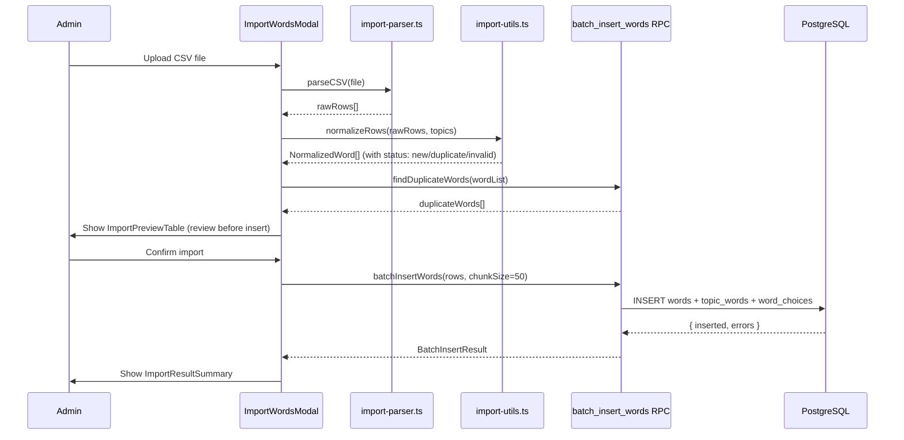
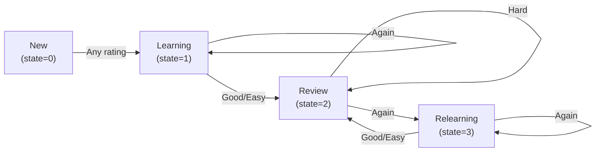
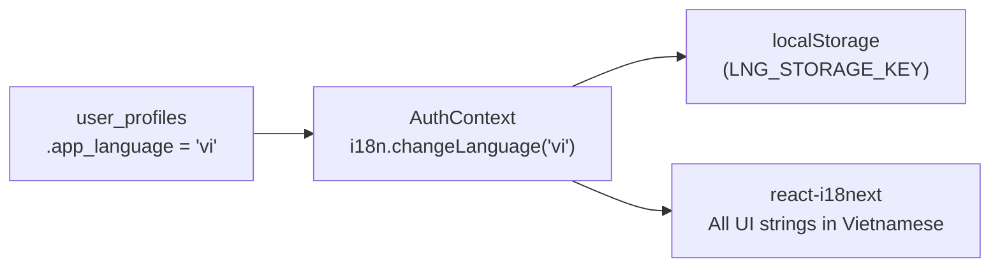

# Data Flow

> **Quick Reference**
> - **Pattern**: Request-Response + Client-side SRS computation
> - **Protocol**: Supabase JS SDK (REST + PostgREST + WebSocket for auth)
> - **Serialization**: JSON
> - **Key Flows**: App Init → Study → Review → Import

See also: [Architecture](./architecture.md) · [Database](./database.md)

## App Initialization Flow

On every login, a single RPC call (`fetch_initial_app_data`) fetches everything the app needs in one round-trip. This "mega-RPC" pattern eliminates waterfall requests.

1. Supabase `getSession()` returns cached JWT — no network round-trip if valid
2. `fetchInitialAppData` calls the `fetch_initial_app_data` RPC — **1 request total**
3. `AuthContext` distributes the result to all consumers via React Context

## Study Session Flow

Key files:
- `useFlashcard.ts` orchestrates the session
- `srs.ts:calculateFSRSReview` computes new scheduling
- Ratings map to FSRS ratings 1–4: Again=1, Hard=2, Good=3, Easy=4 (`src/lib/constants.ts:21`)

## Review Arena Flow

The Review Arena differs from Study: it presents **typed challenges** (not simple flip cards) based on the word's current memory stability.

The quadrant selection logic is in `src/lib/challenge-logic.ts` (`selectQuadrant` function). Challenge types:

| Quadrant | Component | Mechanic |
|----------|-----------|---------|
| `recognition` | `RecognitionChallenge` | Multiple-choice definition |
| `context_gap` | `ContextGapChallenge` | Fill-in-the-blank in example sentence |
| `construction` | `ConstructionChallenge` | Drag-to-reorder jumbled sentence |
| `ghost_recall` | `GhostRecallChallenge` | Write the word from memory |

## Word Import Flow

Admins can bulk-import words via CSV.

Words are inserted in chunks of 50 (`IMPORT_CHUNK_SIZE`, `src/lib/constants.ts:47`) to avoid RPC timeouts.

## SRS Rating → Memory State Transition

The `mastered` flag is set when `stability ≥ 21 days AND state ≠ Relearning` (`src/lib/srs.ts:195`).

## External Integrations

| Service | Protocol | Direction | Data | Purpose |
|---------|----------|-----------|------|---------|
| Supabase Auth | REST/WebSocket | Bidirectional | JWT tokens | User authentication |
| Supabase DB | PostgREST | Bidirectional | JSON rows | All app data |
| Web Speech API | Browser API | Outbound | Audio | Text-to-Speech pronunciation |
| Image CDN (Unsplash/Google) | HTTPS | Inbound | Images | Word illustrations |

## i18n Data Flow

Language preference is stored in `user_profiles.app_language`. On profile load, `AuthContext` syncs the i18n library and `localStorage` (`src/contexts/AuthContext.tsx:193`).

Supported languages: `en` (English), `vi` (Vietnamese). Source of truth: `src/i18n/vi.json`.
