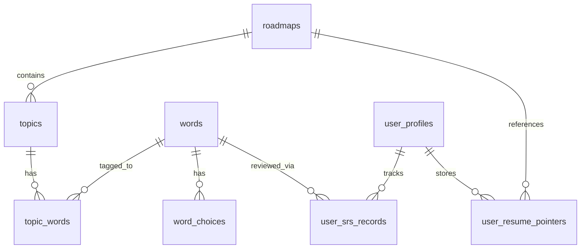

# Database

> **Quick Reference**
> - **Engine**: PostgreSQL (managed by Supabase)
> - **ORM**: None — direct Supabase JS client with typed queries
> - **Core Tables**: 8
> - **Migrations**: Manual SQL scripts in `scripts/`
> - **RLS**: Row-Level Security enabled on all user data tables

See also: [Architecture](./architecture.md) · [Data Flow](./data-flow.md)

## ER Diagram

## Tables

### `roadmaps`

Top-level learning paths (e.g., "Oxford 3000", "IELTS Core").

| Column | Type | Nullable | Description |
|--------|------|----------|-------------|
| `id` | uuid | No | Primary key |
| `name` | text | No | Display name |
| `slug` | text | No | URL-safe identifier |
| `description` | text | Yes | Summary text |
| `image_url` | text | Yes | Cover image |
| `is_active` | boolean | No | Visible to users |
| `created_at` | timestamptz | No | Record creation |
| `updated_at` | timestamptz | No | Last modification |

### `topics`

Thematic groups within a roadmap (e.g., "Technology", "Environment").

| Column | Type | Nullable | Description |
|--------|------|----------|-------------|
| `id` | uuid | No | Primary key |
| `roadmap_id` | uuid | Yes | FK → `roadmaps.id` |
| `name` | text | No | Display name |
| `slug` | text | No | URL-safe identifier |
| `description` | text | Yes | Summary |
| `image_url` | text | Yes | Topic cover image |
| `icon` | text | No | Emoji icon |
| `color` | text | No | Hex color for UI badge |
| `sort_order` | integer | No | Display order within roadmap |
| `created_at` | timestamptz | No | |
| `updated_at` | timestamptz | No | |

### `words`

Vocabulary flashcards — the core learning unit.

| Column | Type | Nullable | Description |
|--------|------|----------|-------------|
| `id` | uuid | No | Primary key |
| `word` | text | No | The English word |
| `phonetic` | text | Yes | IPA notation |
| `pos` | enum | Yes | `noun`, `verb`, `adj`, `adv`, `phrase`, `other` |
| `difficulty` | integer | No | 1–5 scale |
| `definition` | text | No | Meaning (shown on flashcard back) |
| `example` | text | Yes | Example sentence |
| `example_vi` | text | Yes | Vietnamese translation of example |
| `image_url` | text | Yes | Illustration image |
| `image_position` | text | Yes | CSS object-position (`center`, `top`, `bottom`) |
| `tags` | text[] | Yes | Auto-assigned semantic tags |
| `synonyms` | text[] | Yes | Similar words |
| `antonyms` | text[] | Yes | Opposite words |
| `word_family` | text[] | Yes | Morphological variants (run/ran/running) |
| `created_at` | timestamptz | No | |
| `updated_at` | timestamptz | No | |

:::info
The `topic_id` column on `words` is legacy. Topic associations are managed exclusively through the `topic_words` junction table since v2.
:::

### `word_choices`

Wrong answer options used in Recognition and ContextGap challenges.

| Column | Type | Nullable | Description |
|--------|------|----------|-------------|
| `id` | uuid | No | Primary key |
| `word_id` | uuid | No | FK → `words.id` |
| `choice` | text | No | Wrong definition text |
| `sort` | integer | No | Display order (1, 2, 3) |

### `topic_words`

Many-to-many junction table linking words to topics.

| Column | Type | Nullable | Description |
|--------|------|----------|-------------|
| `topic_id` | uuid | No | FK → `topics.id` |
| `word_id` | uuid | No | FK → `words.id` |

### `user_profiles`

Per-user settings, stats, and preferences.

| Column | Type | Nullable | Description |
|--------|------|----------|-------------|
| `id` | uuid | No | FK → Supabase `auth.users.id` |
| `email` | text | No | User email |
| `display_name` | text | Yes | Shown in UI |
| `avatar_url` | text | Yes | Profile image |
| `streak_days` | integer | No | Current study streak |
| `longest_streak` | integer | No | All-time best streak |
| `total_words` | integer | No | Total words ever studied |
| `daily_target` | integer | No | Words per day goal (default: 20) |
| `srs_intensity` | numeric | No | SRS workload multiplier (0.6–1.5) |
| `tts_voice` | text | Yes | Preferred TTS voice name |
| `tts_rate` | numeric | No | Speech speed (default: 0.85) |
| `auto_play_audio` | boolean | No | Auto-pronounce on card reveal |
| `app_language` | text | No | UI language (`en` or `vi`) |
| `theme_mode` | text | No | `light`, `dark`, or `system` |
| `last_study_date` | date | Yes | For streak calculation |

### `user_srs_records`

Per-user FSRS scheduling state for each word. This is the heart of the SRS engine.

| Column | Type | Nullable | Description |
|--------|------|----------|-------------|
| `id` | uuid | No | Primary key |
| `user_id` | uuid | No | FK → `auth.users.id` |
| `word_id` | uuid | No | FK → `words.id` |
| `fsrs_stability` | numeric | No | Memory stability (days to 90% retention) |
| `fsrs_difficulty` | numeric | No | Intrinsic difficulty (1–10) |
| `fsrs_state` | integer | No | 0=New, 1=Learning, 2=Review, 3=Relearning |
| `fsrs_scheduled_days` | integer | No | Days until next review |
| `fsrs_reps` | integer | No | Total review count |
| `fsrs_lapses` | integer | No | Times forgotten |
| `next_review_at` | timestamptz | Yes | Scheduled review datetime |
| `mastered` | boolean | No | True when stability ≥ 21 days |
| `last_reviewed` | timestamptz | Yes | Most recent review time |
| `created_at` | timestamptz | No | |
| `updated_at` | timestamptz | No | |

:::tip SRS States
- **0 (New)**: Never studied
- **1 (Learning)**: First few reps, short intervals
- **2 (Review)**: Stable, spaced intervals
- **3 (Relearning)**: Forgotten, back to short intervals
:::

### `user_resume_pointers`

Tracks the user's last studied topic per roadmap for "Resume" functionality.

| Column | Type | Nullable | Description |
|--------|------|----------|-------------|
| `id` | uuid | No | Primary key |
| `user_id` | uuid | No | FK → `auth.users.id` |
| `roadmap_id` | uuid | No | FK → `roadmaps.id` |
| `last_topic_id` | uuid | Yes | FK → `topics.id` |
| `last_accessed_at` | timestamptz | No | When user last studied this roadmap |

## Relationships

| Table A | Table B | Type | FK |
|---------|---------|------|----|
| `roadmaps` | `topics` | One-to-many | `topics.roadmap_id` |
| `topics` | `topic_words` | One-to-many | `topic_words.topic_id` |
| `words` | `topic_words` | One-to-many | `topic_words.word_id` |
| `words` | `word_choices` | One-to-many | `word_choices.word_id` |
| `auth.users` | `user_profiles` | One-to-one | `user_profiles.id` |
| `auth.users` | `user_srs_records` | One-to-many | `user_srs_records.user_id` |
| `words` | `user_srs_records` | One-to-many | `user_srs_records.word_id` |
| `auth.users` | `user_resume_pointers` | One-to-many | `user_resume_pointers.user_id` |

## Key RPC Functions

VocaFlash uses Supabase RPC (PostgreSQL functions) for atomic multi-table operations:

| RPC Name | Purpose |
|----------|---------|
| `fetch_initial_app_data` | Single round-trip: profile + stats + roadmap on login |
| `get_user_vocabulary_v2` | Mastery Vault: paginated words with FSRS state |
| `upsert_srs_record` | Atomic SRS update after review |
| `batch_insert_words` | Bulk word import with topic assignment |
| `find_duplicate_words` | Pre-import duplicate check |
| `get_progress_page_data` | Analytics dashboard aggregate |

:::info Why RPC?
Multi-table writes (e.g., updating SRS record + incrementing streak + awarding points) must be atomic. PostgreSQL functions guarantee all-or-nothing execution with proper locking.
:::

Migration History

Migrations are managed as SQL scripts in `scripts/`. They are applied manually via `scripts/apply-migration.mjs`.

| Script | Purpose |
|--------|---------|
| `scripts/apply-migration.mjs` | Apply a migration SQL file |
| `scripts/run-migration.js` | Run raw SQL migration |
| `scripts/verify-migration.mjs` | Verify migration applied correctly |
| `scripts/connect-pg.mjs` | Direct PostgreSQL connection helper |

