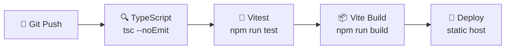

# Deployment Guide

> **Quick Reference**
> - **Platform**: Static hosting (Netlify / Vercel / Cloudflare Pages) + Supabase
> - **Runtime**: Node.js 18+
> - **Build**: `npm run build` → `dist/`
> - **Backend**: Supabase (fully managed, no server to host)

See also: [Architecture](./architecture.md) · [Database](./database.md)

## System Requirements

| Component | Minimum | Recommended |
|-----------|---------|-------------|
| Node.js | 18.x | 20.x LTS |
| npm | 8.x | 10.x |
| RAM | 1 GB | 2 GB (for build) |
| Disk | 500 MB | 1 GB |

## Environment Variables

| Variable | Description | Required | Example |
|----------|-------------|----------|---------|
| `VITE_SUPABASE_URL` | Your Supabase project URL | ✅ | `https://abc.supabase.co` |
| `VITE_SUPABASE_ANON_KEY` | Supabase public anon key | ✅ | `eyJhbGc...` |
| `VITE_ADMIN_EMAILS` | Comma-separated admin emails | Optional | `admin@example.com,super@example.com` |

:::warning Security
- Never commit `.env` to version control — it's in `.gitignore`
- `VITE_SUPABASE_ANON_KEY` is the **public** anon key — safe for client code
- The **service role key** must never appear in frontend code
- See `.env.example` for a reference template
:::

## Local Setup

::: code-group

```bash [npm]
# 1. Clone the repository
git clone https://github.com/Kyo93/voca-flash.git
cd voca-flash

# 2. Install dependencies
npm install

# 3. Configure environment
cp .env.example .env
# Edit .env with your Supabase URL and anon key

# 4. Start development server
npm run dev
# App runs at http://localhost:5173
```

```bash [Check env]
# Verify env vars are loaded correctly
# The app will throw at startup if VITE_SUPABASE_URL is missing
# See: src/lib/supabase.ts:6
```

:::

## Available Scripts

| Script | Command | Description |
|--------|---------|-------------|
| Dev server | `npm run dev` | Vite HMR dev server at `:5173` |
| Production build | `npm run build` | TypeScript compile + Vite bundle → `dist/` |
| Preview build | `npm run preview` | Serve production build locally |
| Unit tests | `npm run test` | Vitest run (single pass) |
| Unit tests watch | `npm run test:watch` | Vitest in watch mode |
| Test gate | `npm run test:gate` | TypeScript + Vitest (CI gate) |
| E2E tests | `npm run test:e2e` | Playwright browser tests |
| E2E with UI | `npm run test:e2e:ui` | Playwright interactive mode |

## Production Build

```bash
npm run build
# Output: dist/
# ├── index.html
# ├── assets/
# │   ├── index-[hash].js    (main bundle)
# │   ├── index-[hash].css
# │   └── [chunk]-[hash].js  (lazy-loaded route chunks)
# └── favicon.svg
```

:::tip Build Optimization
Route-level lazy loading (`React.lazy`) splits the bundle automatically. Each page is a separate chunk loaded on first navigation, minimizing initial load time.
:::

## Deploying to Vercel

```bash
# Framework: Vite
# Build command: npm run build
# Output directory: dist
# Node.js version: 18.x

# Add env vars in Vercel dashboard:
# VITE_SUPABASE_URL
# VITE_SUPABASE_ANON_KEY
# VITE_ADMIN_EMAILS (optional)
```

## Deploying to Cloudflare Pages

```bash
# Build command: npm run build
# Build output directory: dist
# Node.js version: 18

# Add environment variables in Pages settings
```

## Deploying to Netlify

```bash
# Build command: npm run build
# Publish directory: dist
# Node.js version: 18

# Important: Add _redirects file for SPA routing
echo "/* /index.html 200" > dist/_redirects
```

:::info SPA Routing
VocaFlash is a Single-Page Application. All deployment platforms need to serve `index.html` for any path so React Router handles client-side navigation. Configure your host accordingly.
:::

## Supabase Setup

1. Create a new Supabase project at [supabase.com](https://supabase.com)
2. Copy the Project URL and anon key into `.env`
3. Apply database migrations from `scripts/` (see [Database](./database.md))
4. Enable Row-Level Security on all user data tables
5. Configure email auth in Supabase Auth settings

## CI/CD Pipeline



The `test:gate` script (`tsc && vitest run`) serves as the CI gate — if TypeScript or tests fail, the pipeline stops.

## E2E Test Setup

E2E tests use Playwright with a saved auth state:

```bash
# First-time setup: authenticate and save session
npx playwright test tests/e2e/auth.setup.ts

# Run all E2E tests
npm run test:e2e

# Interactive UI mode
npm run test:e2e:ui
```

Auth state is saved to `playwright/.auth/user.json`. Add this to `.gitignore` to avoid committing credentials.

<details>
<summary>Troubleshooting Common Issues</summary>

| Issue | Cause | Fix |
|-------|-------|-----|
| `Missing VITE_SUPABASE_URL` | `.env` not created | Copy `.env.example` to `.env` |
| Blank screen after login | RLS policies not set | Enable RLS + add policies in Supabase |
| Build fails with TS errors | Type mismatch | Run `npx tsc --noEmit` to see errors |
| E2E tests time out | App not running | Start `npm run dev` before E2E |
| Admin panel not visible | Email not in `VITE_ADMIN_EMAILS` | Add email to env var, restart |

</details>
