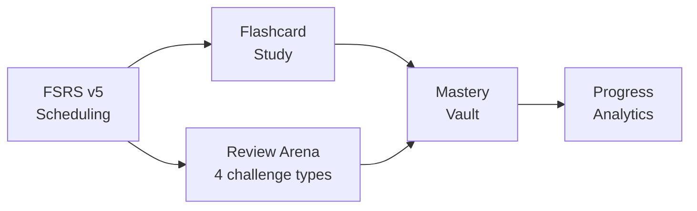
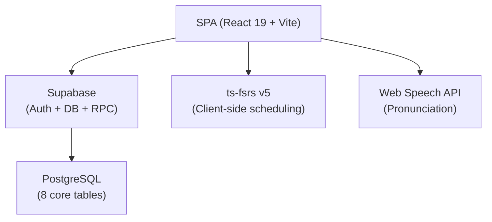

# VocaFlash Documentation

> **Quick Reference**
> - **Product**: VocaFlash — The Tactile Scholar
> - **Stack**: React 19 + Vite + Supabase + FSRS v5
> - **Version**: 1.0.0
> - **Status**: Production

VocaFlash is a premium English vocabulary platform that uses the **FSRS v5 spaced-repetition algorithm** to optimize long-term memorization. Every word you study is scheduled for review at the scientifically optimal moment — right before you'd forget it.

## Quick Navigation

| Section | Description |
|---------|-------------|
| [Codebase Analysis](./analysis.md) | Project overview, tech stack, route map |
| [Architecture](./architecture.md) | System design, components, ADRs |
| [Database](./database.md) | Schema, tables, relationships, RPC functions |
| [Data Flow](./data-flow.md) | End-to-end flows: auth, study, review, import |
| [Deployment](./deployment.md) | Setup, environment, CI/CD |
| [User Guides](./sop/index.md) | Step-by-step feature guides |

## Key Features

| Feature | Description |
|---------|-------------|
| **FSRS v5** | State-of-the-art spaced repetition — adapts to each user's memory |
| **Review Arena** | 4 challenge types: Recognition, Construction, Context Gap, Ghost Recall |
| **Tactile Scholar UI** | Glassmorphism + micro-animations (Framer Motion) |
| **Bilingual** | Full UI in English and Vietnamese (i18next) |
| **Admin Panel** | Word CRUD + bulk CSV import |
| **Progress Analytics** | Heatmap, FSRS distribution, workload forecast |
| **Text-to-Speech** | Native pronunciation via Web Speech API |
| **Cloud Sync** | All data in Supabase (auth + DB + storage) |

## Architecture at a Glance

## Getting Help

- **User Guides** — [sop/getting-started.md](./sop/getting-started.md)
- **Architecture** — [architecture.md](./architecture.md)
- **GitHub Issues** — [github.com/Kyo93/voca-flash/issues](https://github.com/Kyo93/voca-flash/issues)
