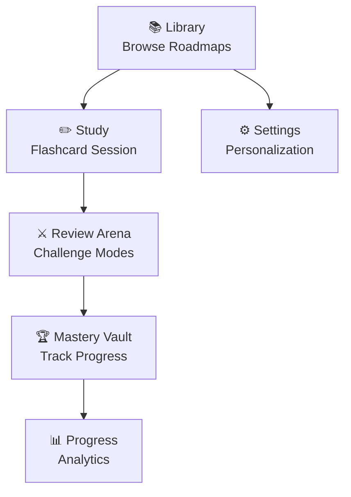

# User Guides

> **Quick Reference**
> - **Total Features**: 6 core user flows
> - **Roles**: Learner, Admin
> - **Last Updated**: April 2026

Welcome to the VocaFlash user guides. Each guide covers one feature from start to finish with step-by-step instructions.

See also: [Architecture](../architecture.md) · [Codebase Analysis](../analysis.md)

## Feature Map

## Feature List

| No. | Feature | Description | Role | Difficulty |
|-----|---------|-------------|------|------------|
| 1 | [Getting Started](./getting-started.md) | Account setup + first study session | Learner | 🟢 Easy |
| 2 | [Study Session](./study-session.md) | Flashcard study with FSRS | Learner | 🟢 Easy |
| 3 | [Review Arena](./review-arena.md) | Challenge-based review (4 modes) | Learner | 🟡 Medium |
| 4 | [Mastery Vault](./mastery-vault.md) | Browse and filter your vocabulary | Learner | 🟢 Easy |
| 5 | [Progress & Analytics](./progress.md) | Streaks, forecasts, memory health | Learner | 🟢 Easy |
| 6 | [Settings](./settings.md) | Profile, SRS intensity, audio, theme | Learner | 🟢 Easy |
| 7 | [Admin: Word Management](./admin-words.md) | Create and import vocabulary | Admin | 🔴 Advanced |
