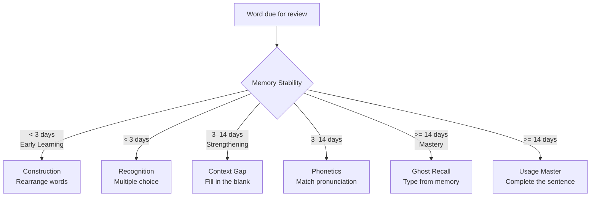

# Review Arena

> **Quick Reference**
> - **Who**: Learner
> - **Where**: Dashboard → Review, or `/review`
> - **Time**: ~15–30 minutes (20 cards per session)
> - **Prerequisites**: Words due for review

The Review Arena presents vocabulary challenges instead of simple flashcards. The type of challenge adapts to each word's **current memory stability** — newer words get easier challenges, mastered words get harder ones.

See also: [Study Session](./study-session.md) · [Data Flow: Review Arena](../data-flow.md)

## Challenge Types

| Challenge | Mechanic | When shown |
|-----------|---------|------------|
| **Recognition** | Choose the correct definition from 4 options | Stability < 14 days + has wrong choices |
| **Context Gap** | Fill in the missing word in an example sentence | Has example sentence |
| **Construction** | Drag/click tokens to rebuild a jumbled sentence | Stability < 14 days |
| **Ghost Recall** | Type the English word from its definition alone | Stability ≥ 14 days |
| **Usage Master** | Complete a sentence using the word | Stability ≥ 14 days + has example |

## Step-by-Step Guide

### Step 1: Open Review Arena

1. Click the **Review** button on the Dashboard (sword/shield icon)
2. — OR — navigate directly to `/review`
3. A loading screen counts down while your due words load

<!-- Screenshot: Dashboard with Review button highlighted -->

### Step 2: Answer a Challenge

Each challenge type has a 30-second timer. Answer before time runs out.

#### Recognition Challenge

1. Read the word shown at the top
2. Read all 4 definition options
3. Click the one you believe is correct
4. Green = correct, Red = wrong

<!-- Screenshot: RecognitionChallenge with 4 options -->

#### Construction Challenge

1. Read the target word and its definition
2. Click tokens in the correct order to rebuild the example sentence
3. Click **Check** when done

:::tip Construction Strategy
Start by identifying the subject (noun) and verb. Place them first, then add modifiers.
:::

#### Context Gap Challenge

1. Read the sentence with a blank `___` 
2. Type the missing word in the input box
3. Press **Enter** to submit

#### Ghost Recall Challenge

1. Read the definition shown
2. Type the English word from memory
3. Diacritics and capitalization are ignored — only spelling matters

:::info Ghost Recall
This is the hardest challenge. It tests **active recall** — you must produce the word, not just recognize it. This is the most effective way to cement vocabulary into long-term memory.
:::

### Step 3: Review Your Answer

After answering:
- **Correct**: Score +10 points, card advances
- **Wrong**: Score 0, word is re-queued (FSRS rating = Again)
- **Timed out**: Treated as wrong

The challenge immediately advances to the next card.

### Step 4: Session Summary

After 20 cards the **Session Summary** appears:
- Total score
- Correct/incorrect breakdown by challenge type
- Streak update
- Points earned

## Scoring

| Event | Points |
|-------|--------|
| Correct answer | +10 |
| Ghost Recall correct | +20 (bonus) |

Points are tracked in the session but not currently persisted — they're motivational only.

## Troubleshooting

🔴 "No cards due for review"

**Cause:** All your words are scheduled for future review, or you haven't studied any words yet.

**Solution:**
1. Complete a [Study Session](./study-session.md) first to add words to your SRS queue
2. Return to Review Arena tomorrow when words are due
3. Use **Free Study** (`/free-study`) to practice without strict scheduling

🔴 Timer runs too fast

**Cause:** 30-second limit per challenge is the design intent.

**Solution:** If you consistently run out of time on Construction challenges, try [Study Session](./study-session.md) mode for those words first to build familiarity.

## Related

- [Study Session](./study-session.md) — flashcard mode (no timer)
- [Progress Analytics](./progress.md) — see your review history
- [Data Flow: Review Arena](../data-flow.md)
