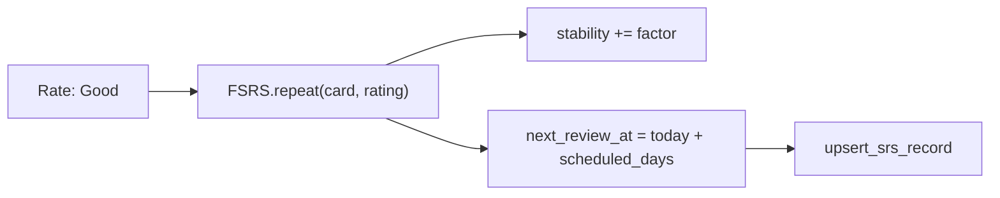

# Study Session

> **Quick Reference**
> - **Who**: Learner
> - **Where**: Dashboard → Study, or Library → Topic → Study Now
> - **Time**: ~10–20 minutes per session
> - **Prerequisites**: At least one roadmap topic selected

The Study Session is your primary daily tool. It presents flashcards for words you need to study today — either brand-new words or words due for review.

See also: [Review Arena](./review-arena.md) · [Getting Started](./getting-started.md)

## Study Modes

Before starting, VocaFlash asks how you want to study:

| Mode | Shows | Best For |
|------|-------|---------|
| **New words only** | Words you've never seen | Building vocabulary |
| **New + Due** | New words + overdue reviews | Balanced daily routine |
| **All words** | Every word in the topic | Comprehensive revision |

<!-- Screenshot: StudyPrepScreen with mode selector -->

## Step-by-Step Guide

### Step 1: Open a Study Session

1. From the **Dashboard**, click **Continue** on your active roadmap (resumes last topic)
2. — OR — go to **Library → [Roadmap] → [Topic] → Study Now**
3. Select your study mode on the prep screen
4. Click **Start**

### Step 2: Study a Flashcard (Front)

The card front shows:
- The English word in large text
- Part of speech (noun/verb/adj…)
- Phonetic transcription (IPA)
- A cover image (if available)

Click the card or press **Space** to flip it.

<!-- Screenshot: Flashcard front with word, phonetic, image -->

### Step 3: Review the Back

The card back reveals:
- Vietnamese definition
- Example sentence in English
- Example sentence in Vietnamese
- An audio button to hear pronunciation

Take a moment to honestly assess whether you knew the word before flipping.

### Step 4: Rate Your Memory

After flipping, choose a rating:

```
[ Again ]   [ Hard ]   [ Good ]   [ Easy ]
   1           2          3          4
```

The rating buttons also show the **interval preview** — how many days until the word appears again.

| Button | Meaning | Interval example (new word) |
|--------|---------|---------------------------|
| **Again** | Forgot completely | ~10 minutes |
| **Hard** | Recalled with effort | ~1 day |
| **Good** | Recalled correctly | ~3 days |
| **Easy** | Instant recall | ~7+ days |

:::tip Be Honest
The algorithm only works if your ratings are accurate. If you had to think for more than a few seconds, choose **Hard** not **Good**.
:::

### Step 5: Audio Pronunciation

1. Click the **speaker icon** on the card back
2. The word is spoken using your browser's Text-to-Speech
3. Adjust the voice and speed in **Settings → Audio**

Audio auto-plays if you enabled **Auto-play audio** in Settings (`src/components/study/FlashcardBack.tsx`).

### Step 6: Session Complete

When all cards in the session are rated, the **Study Complete** screen shows:
- Words studied count
- New vs. review breakdown
- Streak update (if you hit your daily target)

Click **Back to Dashboard** or **Study More** to continue.

## FSRS Rating Mechanics

VocaFlash uses **FSRS v5** (`src/lib/srs.ts:168`). Each rating updates two internal values:

| Value | Description |
|-------|-------------|
| **Stability** | Days until you hit your retention target (default 90%) |
| **Difficulty** | How hard this word is for you personally (1–10) |

Words with stability ≥ 21 days are marked **Mastered** (`src/lib/srs.ts:195`).



## Troubleshooting

<details>
<summary>🔴 "No cards to study" message</summary>

**Cause:** All words in this topic are either mastered or not yet due.

**Solution:**
1. Try switching study mode to **All words**
2. Check a different topic in the same roadmap
3. Open **Review Arena** to study overdue words across all roadmaps

</details>

<details>
<summary>🔴 Audio not playing</summary>

**Cause:** Browser TTS not available, or volume muted.

**Solution:**
1. Ensure your device volume is on
2. Try a different browser (Chrome has best TTS support)
3. Go to **Settings → Audio** and select a different voice

</details>

## Related

- [Review Arena](./review-arena.md) — challenge-based review
- [Mastery Vault](./mastery-vault.md) — see all your words
- [Settings — SRS Intensity](./settings.md)
