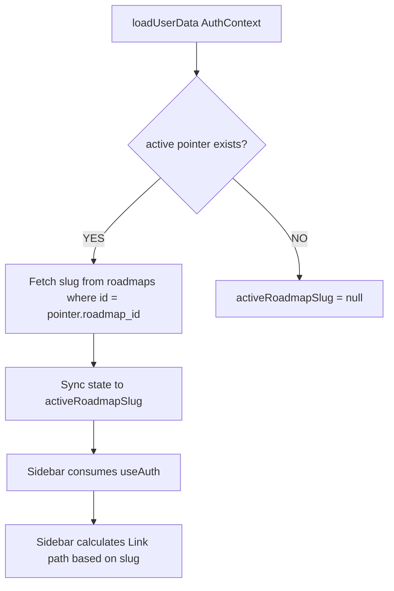

# Design: Smart Library Navigation

Cải tiến Sidebar để cá nhân hóa việc điều hướng "Thư viện" (thẳng vào Roadmap đang học).

## Data Flow

## Proposed Changes

### 1. `AuthContext.tsx`
- **State**: `activeRoadmapSlug: string | null`.
- **Logic**: Trong `loadUserData`, truy vấn `user_resume_pointers` order by `last_accessed_at DESC` limit 1. Sau đó lấy slug từ table `roadmaps`.
- **Performance**: Chạy song song với việc fetch profile để không gây trễ (lag).

### 2. `Sidebar.tsx`
- **Dynamic Items**: `navItems` được chuyển sang dạng `useMemo` phụ thuộc vào `activeRoadmapSlug`.
- **Path Calculation**:
    - Nếu có slug: `/library/${slug}`.
    - Nếu không: `/library`.
