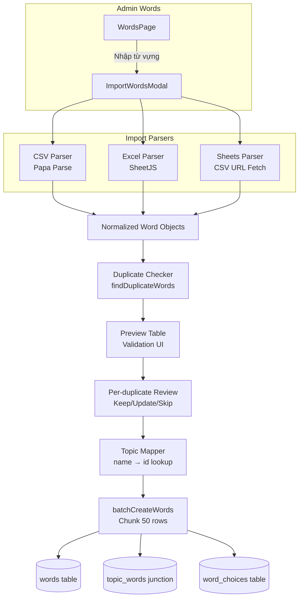

# Proposal: Import Từ vựng trong Admin Panel
Generated by: cm-brainstorm-idea
Date: 2026-04-13

---

## Why we're doing this

### Qualified Problem

**For:** Admin users
**Who:** Cần quản lý kho từ vựng lớn (500-5000 từ cùng lúc)
**The:** Admin Panel là một hệ thống quản lý từ vựng 1-by-1
**That:** Không có cách nào import hàng loạt từ file ngoài → gây tốn thời gian và cản trở mở rộng nội dung
**Unlike:** Các app học từ vựng khác (Anki, Quizlet) đều có import CSV/Excel
**Our approach:** Xây dựng tính năng import đa format với preview, per-duplicate review, và multi-topic support

### Root Causes:
1. **Tech:** Hệ thống chỉ có `createWord()` đơn lẻ — không có batch API
2. **Product:** Không có UX flow cho bulk import
3. **Design:** Admin UI hoàn chỉnh nhưng thiếu entry point cho bulk operations

### Impact if NOT addressed:
- Admin mất 30-60 phút nhập 50 từ thủ công → tỷ lệ bỏ cuộc cao
- Không thể mở rộng kho từ vựng nhanh → bottleneck nội dung
- Người dùng phải dùng tool ngoài (Excel → copy-paste) → không nhất quán

### 9 Windows Analysis Summary

```
PAST ─── Single-entry WordFormModal, no batch capability
PRESENT ─ Full CRUD with junction tables, but 1-by-1 only
FUTURE ── Multi-format import, AI-assisted parsing, collaborative sheets
```

---

## What's changing

### Options Evaluated

| Option | Approach | Effort | Risk |
|--------|----------|--------|------|
| **A: CSV Only** | Upload CSV → parse → preview → insert | ~1 day | Low |
| **B: Full 3-Format (CSV + Excel + Google Sheets)** ⭐ | 3 input modes, per-duplicate review, preview | ~2-3 days | Medium |
| **C: AI Paste** | Paste raw text → AI parse | ~2 days | High |

### Recommendation: **Option B — Full 3-Format Import**

User confirmed requirements:
- Support: CSV + Excel (.xlsx) + Google Sheets URL
- Duplicate handling: Ask per-word (not skip blind)
- Preview before import: Full preview table

---

## Design Specification

### CSV File Format (Required)

```csv
word,phonetic,pos,difficulty,definition,example,example_vi,image_url,topics
hello,/həˈloʊ/,noun,2,Xin chào,"Hello, world!","Xin chào, thế giới!",https://...,Travel;Greetings
```

**Column specifications:**
| Column | Required | Notes |
|--------|----------|-------|
| `word` | ✅ Yes | English word — primary key for duplicate detection |
| `phonetic` | No | IPA format |
| `pos` | No | `noun\|verb\|adj\|adv\|phrase\|other`, default `noun` |
| `difficulty` | No | `1-5`, default `3` |
| `definition` | ✅ Yes | Vietnamese definition |
| `example` | No | English example sentence |
| `example_vi` | No | Vietnamese translation of example |
| `image_url` | No | Unsplash or CDN URL |
| `topics` | No | Semicolon-separated topic names, e.g. `Travel;Business` |

### Google Sheets Integration

1. Admin provides **public Sheets URL**
2. System fetches as CSV export: `https://docs.google.com/spreadsheets/d/{ID}/export?format=csv`
3. Parse same as CSV upload
4. Support authenticated sheets (optional, Phase 2)

### Import Modal Flow

```
[Upload / Paste URL / Paste Text]
    ↓
[Parse & Validate]
    ↓
[Preview Table] ←─ Highlight: missing required fields (red), duplicate rows (yellow)
    ↓
[Duplicate Review] ←─ Per-row: Keep Existing / Update / Skip
    ↓
[Topic Mapping] ←─ Map column → topic names (auto-match + manual)
    ↓
[Confirm & Import] ←─ Batch insert, progress bar, result summary
```

---

## Next Steps for cm-planning

### 1. Specific scope to plan
- `src/components/admin/ImportWordsModal.tsx` — main modal, 3-tab interface
- `src/lib/import-parser.ts` — CSV, Excel (SheetJS), Google Sheets URL parser
- `src/hooks/admin/useImportVocabulary.ts` — import state machine
- `src/lib/admin-queries.ts` — add `batchCreateWords()`, `findDuplicateWords()`
- `src/pages/admin/WordsPage.tsx` — add "Nhập từ vựng" button
- `vi.json` — i18n strings for import flow
- `package.json` — add `xlsx` (SheetJS), `papaparse` (CSV)

### 2. Key constraints to respect
- i18n: ALL UI strings via `t()` from `vi.json`
- Multi-topic support via `topic_words` junction table
- Batch insert in chunks of 50 rows (Supabase timeout)
- UTF-8 encoding throughout (tiếng Việt support)
- Error isolation: partial failures don't rollback successful rows
- No new DB tables — reuse existing schema

### 3. Technical decisions already made
- SheetJS for Excel parsing (de-facto standard, ~400KB)
- Papa Parse for CSV parsing (lightweight, streaming)
- Google Sheets via public CSV export URL (no OAuth needed for public sheets)
- Per-word duplicate review (user requirement)
- Preview before import (user requirement)

### 4. Open questions for implementation — ALL ANSWERED ✅
- **Transaction strategy:** Batch RPC call (Supabase `rpc` with chunk 50 rows)
- **Wrong choices from import:** CÓ — file chứa 3 cột `wrong1`, `wrong2`, `wrong3`
- **Chunk size:** 50 rows OK (config mặc định)
- **Error reporting:** Không cần email notification
- **Template download:** CÓ — nút "Tải template CSV" trong modal
- **CSV format mở rộng:** Thêm 3 cột `wrong1`, `wrong2`, `wrong3`

**Updated CSV Template:**
```csv
word,phonetic,pos,difficulty,definition,example,example_vi,image_url,topics,wrong1,wrong2,wrong3
hello,/həˈloʊ/,noun,2,Xin chào,"Hello!","Xin chào!",https://...,Travel;Greetings,hola,greetings,hi
```

### Full CSV Spec:

| # | Column | Required | Notes |
|---|--------|----------|-------|
| 1 | `word` | ✅ | English word — primary key for duplicate detection |
| 2 | `phonetic` | No | IPA format, e.g. `/həˈloʊ/` |
| 3 | `pos` | No | `noun\|verb\|adj\|adv\|phrase\|other`, default `noun` |
| 4 | `difficulty` | No | `1-5`, default `3` |
| 5 | `definition` | ✅ | Vietnamese definition |
| 6 | `example` | No | English example sentence |
| 7 | `example_vi` | No | Vietnamese translation |
| 8 | `image_url` | No | Unsplash or CDN URL |
| 9 | `topics` | No | Semicolon-separated topic names, e.g. `Travel;Business` |
| 10 | `wrong1` | No | Wrong choice option 1 |
| 11 | `wrong2` | No | Wrong choice option 2 |
| 12 | `wrong3` | No | Wrong choice option 3 |

### Import Flow with Updated Schema:

```
[Upload CSV/Excel/Sheets URL]
    ↓
[Parse 12 columns → Normalized Word Objects]
    ↓
[Preview Table] ←─ Highlight: missing word/definition (red), duplicate (yellow)
    ↓
[Duplicate Review per-row: Keep Existing / Update / Skip]
    ↓
[Topic Mapping: topic name → id via lookup table]
    ↓
[Batch RPC: insert words (chunk 50) + word_choices + topic_words]
    ↓
[Result Summary: X inserted, Y skipped, Z errors]
```

---

## Context for downstream skills

- **cm-planning:** Phase-by-phase plan for 3-file-support import modal + backend batch APIs
- **cm-tdd:** Test coverage for parser edge cases (encoding, malformed rows, empty cells)
- **cm-ux-master:** Modal design with 3-tab layout, preview table, per-row actions
- **cm-execution:** Suggested execution mode: iterative per-file-type (CSV → Excel → Sheets)

---

## Architecture Diagram (Target)



---

_Generated: 2026-04-13 by cm-brainstorm-idea_
